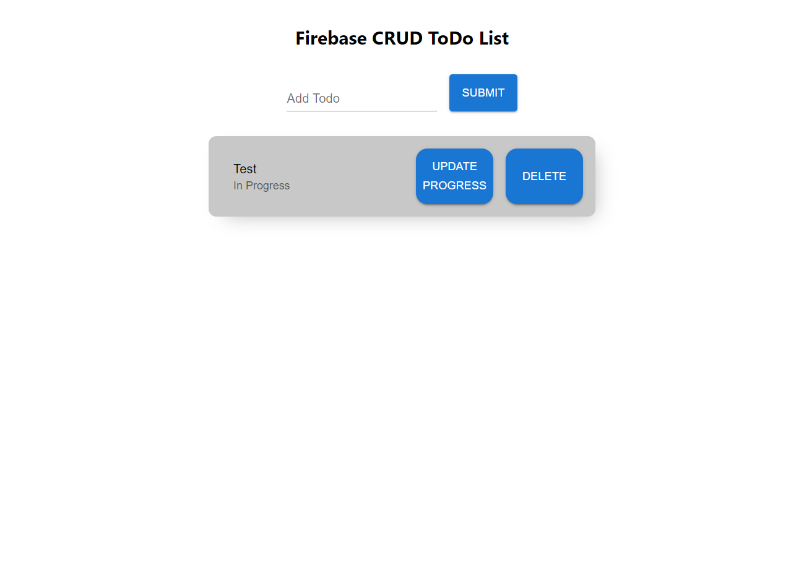

# ToDo CRUD App - ReactJS

## :link: Live Demo

[Demo Link](https://firebase-todo-two.vercel.app/)

## 📷 Screenshot




## 📝 Project Description

CRUD React Todo application using Firebase

## 📚 Technologies

- ReactJS
- Firebase
- ReactHooks
- Material UI

## 🎯 Features

- Add/remove ToDo
- Upgrade Progress

## :runner: Run Locally

Clone the project

```bash
  git clone https://github.com/trstefan/firebase-todo.git
```

Go to the project directory

```bash
  cd firebase-todo
```

Install dependencies

```bash
  npm install
```

Start the server

```bash
  npm run start
```
